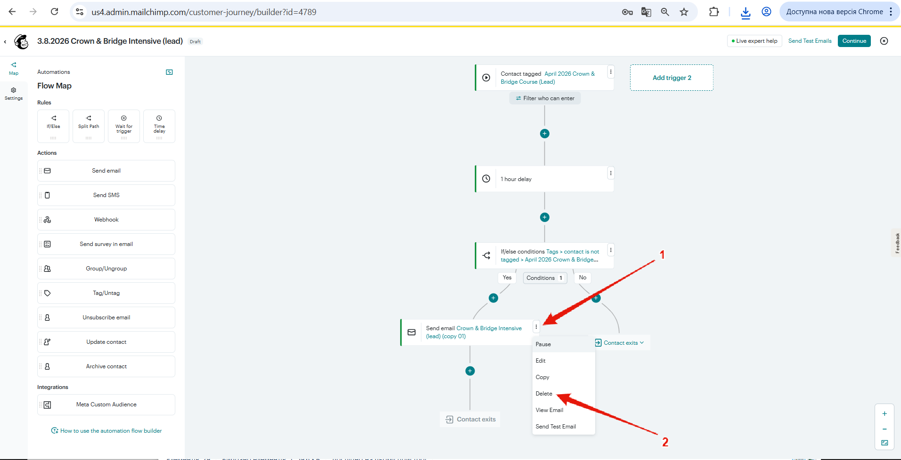

# BCDenalClub.
## Робота із сайтом.
Для додавання/змін продуктів потрібно попрацювати із розділом відповідного продукту на сайті.  
Для початку роботи потрібно залогінітися на сайті та перейти на сторінку продукту.  
Для внесення змін на сторінці необхідно перейти в розділ **"Edit with Elementor"**  
  
Для зміни даних щодо показників продукту (дати, час, тощо) необхідно виділити відповідний блок праворуч (1) і внести зміни у блоці (2), який відкриється ліворуч.  
  

Плагін **Elementor** дозволяє визначати дії, які відбуваються при відправці форми. Передивитися ці дії модна в розділі **Actions after submit**, який знаходиться праворуч.  
  

### Redirect

Після того, як користувач відправляє форму за логікою процесу він має попадати на сторінку оплати відповідного курсу. Для цього використоується розділ **Redirect**. Для того, щоб в платіжній сторінці був заповнений електронна поштова адреса така сама, як і та, яка введена при відправці пошти при редіректі прописуємо в якості GET-параметру **prefiled_email** зі значенням - шорт код, що відповідає полю введення електронної поштової адреси.  

  

Уточнити шорт-код можна у розділі, який відповідає форму відправки даних.  

  

### Site+MailChimp
Якщо додається новий продукт, то для нього потрібно створити новий тег. Це робиться в інтерфейсі сервісу **MailChimp**.
  

Плагін **Elementor** дозволяє в якості події після відправки форми виконати дію щодо прикріплення певного тегу для певного email в сервісі **MailChimp**.
Для цього у блоці відповідної дії треба позначити тег, який треба прікріпити до користувача, що заповнуює форму.  При цьому, зв'язати поля форми для відправки даних та поля MailChimp та з'єднати сайт та відповідний обліковий запис MailChimp (робиться один раз, на цьому скріншоті не позначено).  

  

### MailChimp. Lead reminder.
Для того, щоб реалізувати ланцюг нагадування клієнту, щодо оплати (якщо він заповнив форму і не оплатив впродовж 1 години). Ми використовуємо **MailChip Automation**.

  

Для створення нового flow ми можемо використати існуючий (скопіювавши його).

  

Або ж створити новий:  

  

В flow є такі елементи як тег, при якому запускається automation (1), час, який проходить до перевірки, чи змінився тег на той, що відповідає покупці (2), перевірка, яи є у користувача тег, який відповідає покупці (3), повідомлення, що відправляється користувачеві, який не купив за відведений термін (4).

  

Клієнт періодично створює повідомлення окремо. Їх неможливо перенести в automation автоматично, тому для їх переносу, як інструмент, є створення шаблону із такого повідомлення: 
   
   
   

   
   
   
   
   
   
   
   
   
   
   
   
   
   
   

