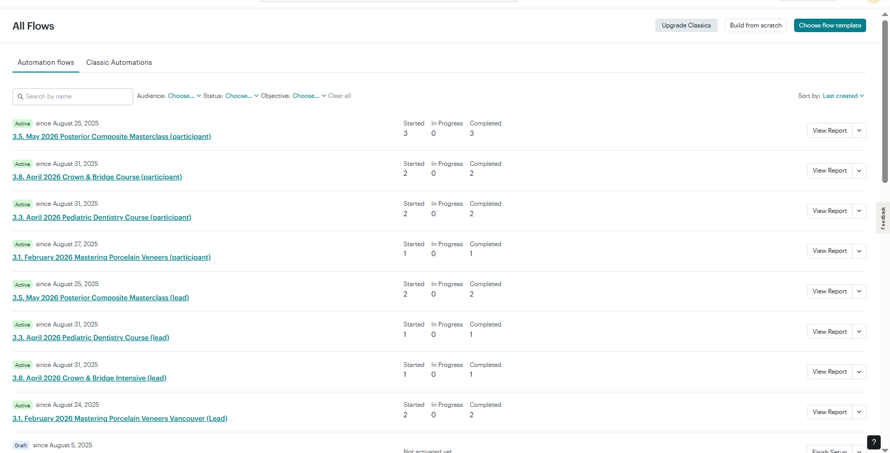
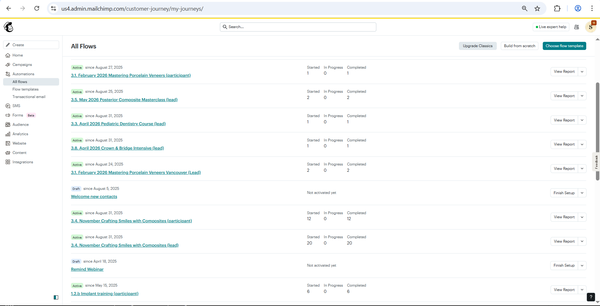
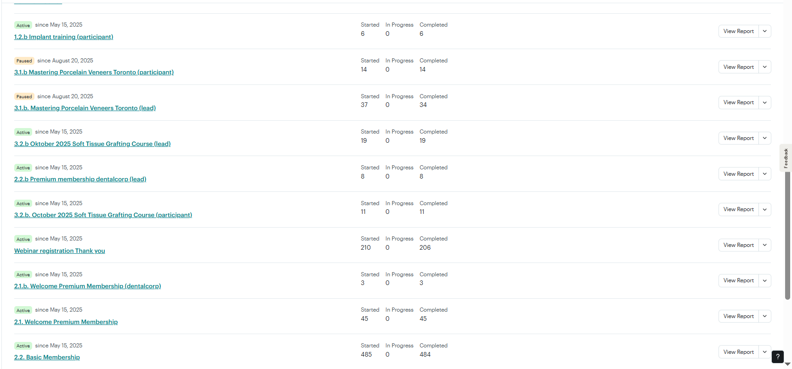
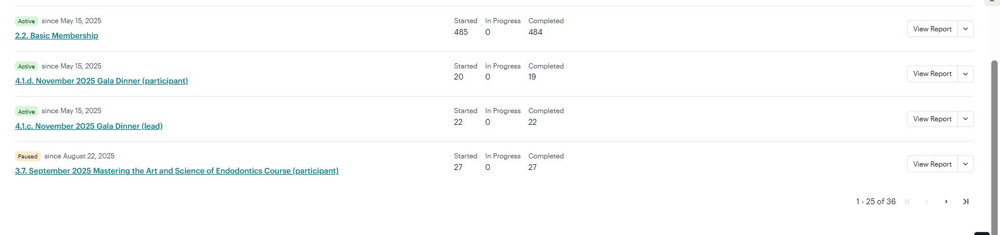
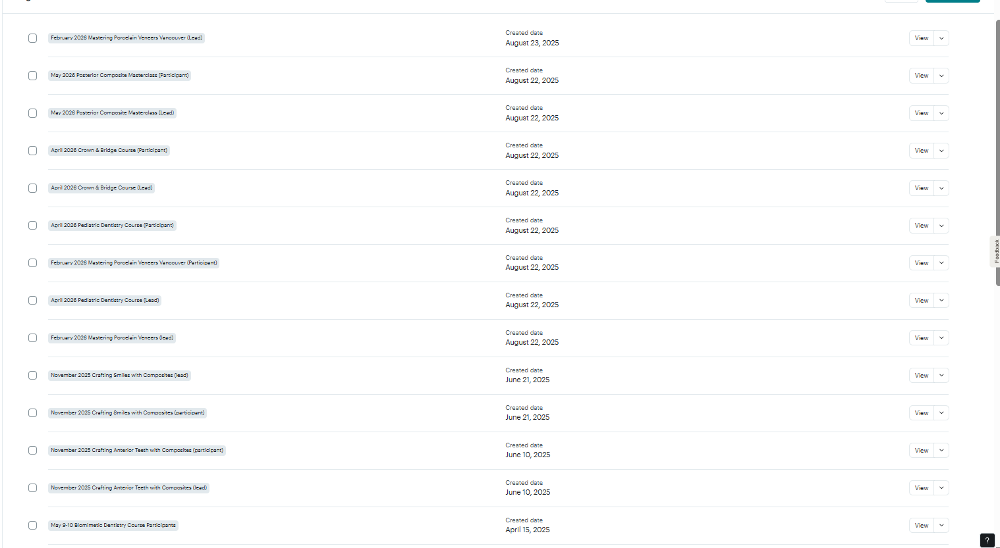
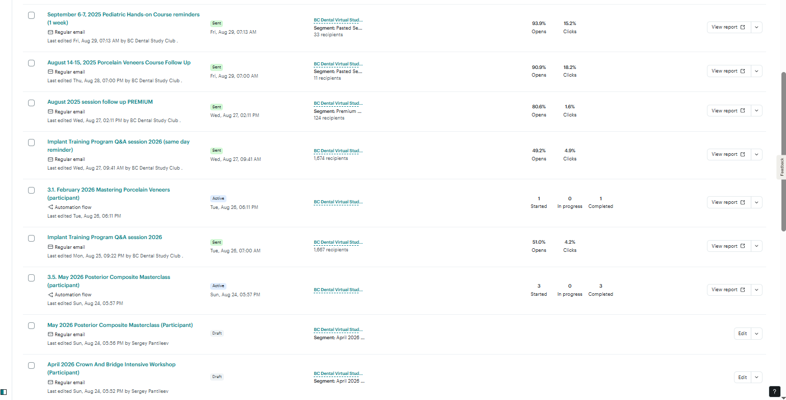
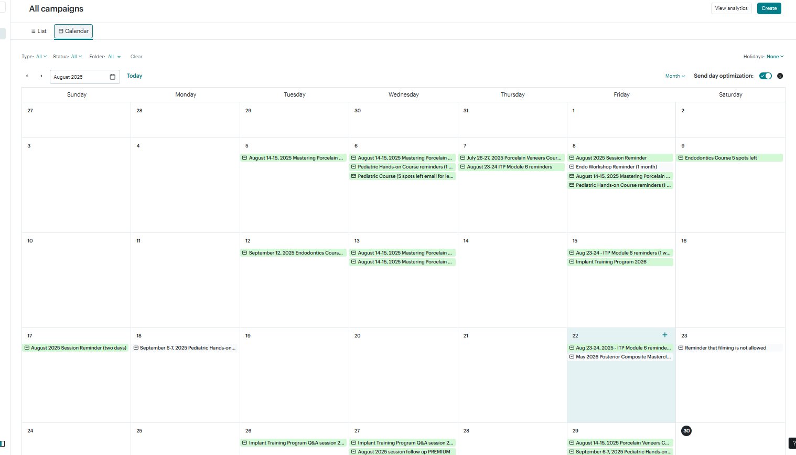
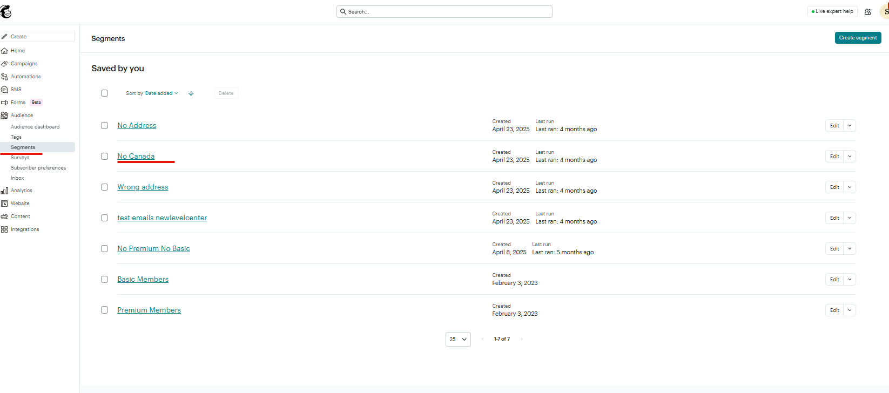

# BCDenatl
Вся створеня інформаційна система складається з 3-х частин: сайт, Zpaier, MailChimp. Іншим виміром даної кампанії є продукти: курси, членство та вебінари. Для того, щоб перевірити і проконтролювати все необхідно пройти всі елементи так, щоб вони відповідали визначеним критеріям якості, також забезепчити лише актуальні ланцюги листів (в тому числі, щоб застралі ланцюги не відповолікали увагу). Всі ці елементи - задокументувати за допомогою скріншотів для того, щоб, за умови можливих збоїв можна було проконтрлювати відповідні зміни, якщо вни були внесені замовником, або ж надавачем сервісу.  
## Перелік послуг
### Активні курси
* The Ultimate Implant program (2026)
* Vancouver Mastering Porcelain Veneers
* Toronto Mastering Porcelain Veneers
* Pediatric Dentistry Hands-on
* Soft Tissue Grafting Hands-On Course
* Crafting Smiles with Composites
* Posterior Composite Masterclass
* Crown & Bridge Intensive Workshop
* Mastering the Art and Science of Endodontics
### Нективний курс
* Biomimetic Restorative Dentistry: Foundation and Techniques
### Підписки
* Premium membership
* Basic membership
### Події
* NOVEMBER 2025 GALA DINNER
### Вебінари
* Вебінар

## Сайт
На сайті потрібно перевіряти стоірнки послуг, а також сторінки викладачів. А також періодично оновлювати плагіни WordPress. При цьому певні плагіни, як, наприклад, **Elementor Pro** не оновлюється на пряму з адміки (виникає помилка). Для цого оновлення необхідно використати панель оновлення на хостингу Hostinger.

## Mailchimp
### Automations
В сервісі розсилок варто перевірити **Automation flow**: вони існують по 2 на кожний продукт в форматі курсу. Один - це нагадування, а другий - це підтвердження оплати.
Перелік всіх **Flow**:
  
  
  
  
  
### Tags
Активні теги виглядають наступним чином:  
  

### Campaigns
Клієнт - самостійно запускає компанії повідомлень (наприклад, нагадування). Перелік таких кампаній виглядає наступним чином:  
У вигляді списку:  
  

У вигляді календарю:  
  

### Segments
Іноді буває необхідно виділити певні сегменти користувачів. Наприклад, "клієнти не з Канади", "Клієнти без адреси"... Для цього зручно використовувати функціонал розділу Segments.  
  

