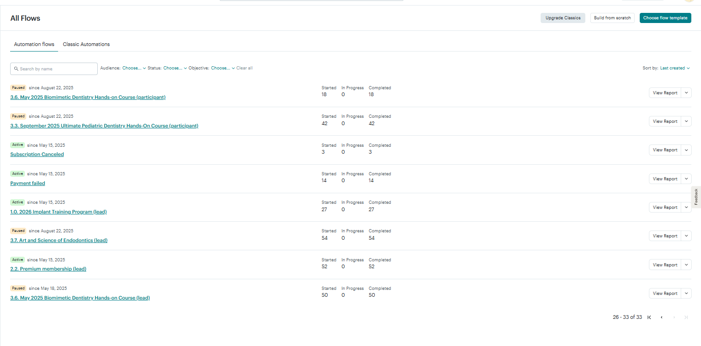

# BCDenatl
Вся створеня інформаційна система складається з 3-х частин: сайт, Zpaier, MailChimp. Іншим виміром даної кампанії є продукти: курси, членство та вебінари. Для того, щоб перевірити і проконтролювати все необхідно пройти всі елементи так, щоб вони відповідали визначеним критеріям якості, також забезепчити лише актуальні ланцюги листів (в тому числі, щоб застралі ланцюги не відповолікали увагу). Всі ці елементи - задокументувати за допомогою скріншотів для того, щоб, за умови можливих збоїв можна було проконтрлювати відповідні зміни, якщо вни були внесені замовником, або ж надавачем сервісу.  
## Перелік послуг
### Активні курси
* The Ultimate Implant program (2026)
* Vancouver Mastering Porcelain Veneers
* Toronto Mastering Porcelain Veneers
* Pediatric Dentistry Hands-on
* Soft Tissue Grafting Hands-On Course
* Crafting Smiles with Composites
* Posterior Composite Masterclass
* Crown & Bridge Intensive Workshop
* Mastering the Art and Science of Endodontics
### Нективний курс
* Biomimetic Restorative Dentistry: Foundation and Techniques
### Підписки
* Premium membership
* Basic membership
### Події
* NOVEMBER 2025 GALA DINNER
### Вебінари
* Вебінар

## Сайт
На сайті потрібно перевіряти стоірнки послуг, а також сторінки викладачів. А також періодично оновлювати плагіни WordPress. При цьому певні плагіни, як, наприклад, **Elementor Pro** не оновлюється на пряму з адміки (виникає помилка). Для цого оновлення необхідно використати панель оновлення на хостингу Hostinger.

## Mailchimp
### Automations
В сервісі розсилок варто перевірити **Automation flow**: вони існують по 2 на кожний продукт в форматі курсу. Один - це нагадування, а другий - це підтвердження оплати.
Перелік всіх **Flow**:
  
  
  
  
  
### Tags
Активні теги виглядають наступним чином:  
  

### Campaigns
Клієнт - самостійно запускає компанії повідомлень (наприклад, нагадування). Перелік таких кампаній виглядає наступним чином:  
У вигляді списку:  
  

У вигляді календарю:  
  

### Segments
Іноді буває необхідно виділити певні сегменти користувачів. Наприклад, "клієнти не з Канади", "Клієнти без адреси"... Для цього зручно використовувати функціонал розділу Segments.  
  

## Zapier
Всі запи мають вигляд.
  

###  Типи Zap
в цілому маємо **автоматизації продажів** (коли відбуваються дії після продажу: підписка на **MailChimp** із відповідним тегом, додавання до групи в **DrivEd**). Так **автоматизації скасування підписок** (якщо клієнт скасовує підписку, або ж підписка скасовується через відсутність оплати). Під кожний продукт зазвичає є обидва варіанта автоматизації. Проте скасування є тільки у продуктів, які є підписками. А це лише **Implant training program 2026** та **Premium membership**.
### Автоматизації
**Implant training program 2026**
Це - найбільш складний за логікою продукт. В якому є відкладена підписка, яка генерується за допомогою запиту до API Stripe.
  
Через те, що в цьому продукті є підписка - для нього є автоматизація відписки.

  

**Premium Membership**
Підписка на даний продукт виглядає наступним чином:
  
В продукті Premium Membership є також варіант Premium Membership dentalcorp (преміальне членство для представників комапанії-партенра)

  

Відписка від продукту Premium Membership
  

**Basic Membership**
Сформвана логіка, щоб всм, хто навіть просто заповнив форму - додавати тег Basic Membership. Єдине виключення - для підписників, які мають вже Premium membership.
   

#### 03.1. (2026) Mastering Porcelain Veneers - Vancouver
   

#### 03.1.b Mastering Porcelain Veneers - Toronto
Needs t6 upgrade Premium membership check
   

#### 03.2.a. Soft Tissue Grafting Hands-On Course
   

Need to check: we have only old group. Need to update group for the new cohort.
   

#### 03.3.c (2026) Pediatric Dentistry Course
   
Знайдено помилку: клієнт змінив продукт в Stripe і не довів до відома. Через це сайт - посилався на не працюючий товар.
https://gyazo.com/f8b19343eb6fe9982b43091249bf0bc0  

https://gyazo.com/96c45ea5c29ee3e535b80c4c1480ed0b 

#### 03.4.d. Crafting Anterior Teeth with Composites
  
Для цього продукту немає нової групи
https://gyazo.com/ddd045d51629ffdbdd2c681bb5a7fd73

#### 03.5.e. (2026) Posterior Composite Masterclass
  

#### 03.6.b. Biomimetic Restorative Dentistry: Foundation and Techniques
Зап вимкнено, в тому числі, через те, що продукт прибраний з сайта.
  

#### 03.7.f. September 2025 Mastering the Art and Science of Endodontics
  

#### 03.8.g. (2026) Crown & Bridge Intensive Workshop

  

#### 4.1.b Events participant (November)
  

#### 4.2. Webinars
Якщо користувач підписується на вебінар і до цього не підписаний на Basic чи Premium, то робимо підписку на Basic Membership
  