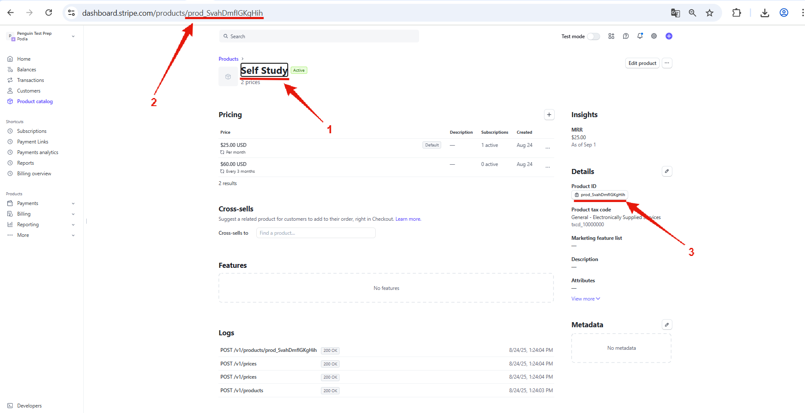
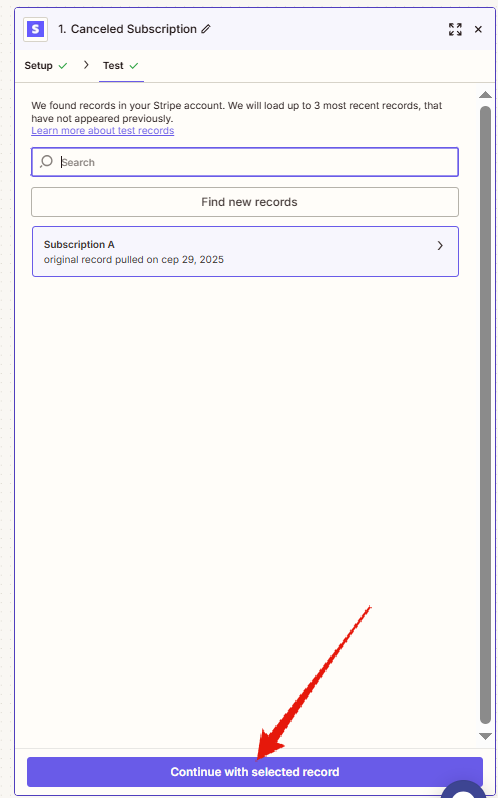
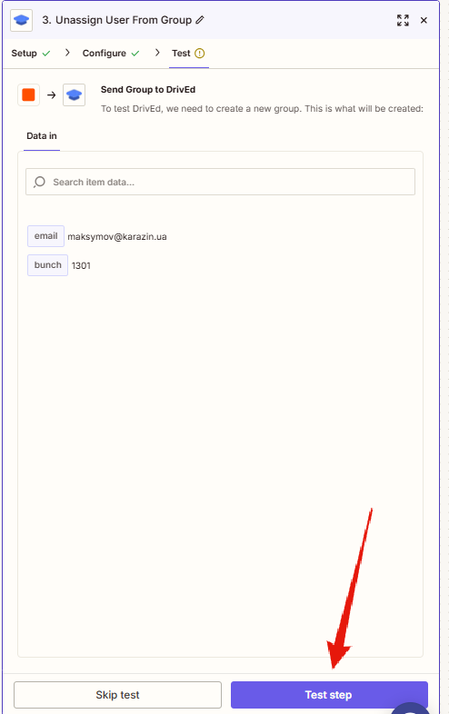

# Запуск процесу
Підключення проекту полягає в тому, щоб створити для кожного продукту Zap на підключення (при продажу клієент додається до групи в DrivEd, а також клієенту надсилається вітальне повідомлення), а також для кожного продукту Zap на відключення на випадок скасування підписки.
  
  ## Створення Zap
Бажано створювати Zap до відповідного клієнту у відповідній папці.  
    
Починаємо зі створення тригеру (це подія, я якої починається виконання Zap)  
    
Обираємо застосунок Stripe  для обрання тригерів.    
     
Через те, що це новий клієнт - важливо підключити новий API для   
    
  
Stripe буде пропонувати дати доступ до тестових даних. **Тестові дані** - інструмент, який дозволяє розібратися із принципами роботи API Stripe, проте він не дозволяє перевіряти реальну роботи flow, адже генеруєтья не за реальними подіями. Тому, якщо є хоча б базовий досвід і достатній рівень обережності, то підключення тестових даних не є необхідним.
     
  
В акаунті **Stripe** може бути декілька розділів, що відповідають клієентам. Обираємо той, який відповідає тому клієнту для якого налаштовуємо даний **automation**.
  
     
  
Після вибору облікового запису натискаємо кнопку "**Continue**"
     
  
Low-code системи (в т.ч. і Zapier) мають механізми перевірки взаємодії з зовнішніми сервісами. Для цього перед додаванням будь-якого елементу, що використовує таку взаємодію відбувається його тестування (для тригерів - отримуються дані від зовнішнього сервісу, для дій (actions) на зовнішній сервіс відправляють певні дані і отримується відповідь).  
В даному випадку - відбувається тест тригеру **New Subscription** від **Stripe**.
    
     
  
Для нових облікових записів може не бути зе підписок в обліковому записі:
    
  
Відповідно до цього - треба таку підписку створити, зробивши тестове придбання:  
Для цього створимо купон зі знижкою. Для підписок можлива 100% знижка

    
  
Для підписок можлива 100% знижка
  
  
Відповідно для застоусування знижки введемо промокод
  
  
Отримуємо повідомлення, що підписка підбулася
  
  
Відповідно до цього - бачимо підписку в переліку підписок в **Stripe**.
    
  
Маючи підписку ми можемо повернутися до **Zapier** і ще раз протестувати тригер
  
  
В результаті тесутвання **Zapier** отримує інформацію від **Stripe** щодо існуючих підписок. Через те, що така підписка одна ми отримаємо відповідну інформації у відповіді від **Stripe** (1). Для продовження натиснемо відповідну кнопку (2).
  
    
  
При продовженні **Zapier** нас попросить обрати сервіс для **Action**. Це - хороше рішення для UX, адже в будь-якому Zap має бути хоча б 1 action. Тому запропонувати його одразу - зручна можливість, хоча і може збити з пантелику тих, хто робить свій Zap вперше.
  
    
  
В фільтрі є 3 елемента (**Choose fields**, **Choose conditions**, **Enter text or insert data**). Відповідно - ми обираємо джерело даних, уомови порівняння та значення із яким порівнюємо.  
В якості джерела даних ми оберемо поле **Items plan product** яке має код продукта. 
  
    
  
Умовою порівняння оберемо "**Exacly matched**" (співпадає).
  
    
  
В якості параметра візьмемо значення ID продукту **Self Study** (1), який можна взяти в адресному рядку (2), або у відповідному блоці (3).
  
    
  
Отримане значення Product ID додаємо до відповідного поля (1) та натискаємо кнопку **Continue** (2) для продовження.  
  
    
  
  **Zapier** перевіряє створений фільтр із умови успіху видає овідомлення в зеленому блоці (1), після чого ми можемо натиснути "**Continue**" (2) для продовження

    
  
  **Zapier** знову нас запитує про наступний Action

    
  
І ми обираємо **DrivEd** для створення **Action** додавання користувача до групи.
  
    
  
Якщо підуключення до **DrivEd** відбувається вперге, то ми маємо натиснути кнопку **Select**
  
    
  
Проте, може бути така ситуація, коли у вас вже підулючений **DrivEd** для інших проектів. В такому випадку треба все одно підулючити DrivEd по новій. Це потрібно через те, що школу DrivEd виначає за переданим ID. Тобто кожну школу треба підключати окремо.
  
    
  
Значення ID школи ми можемо отримати в **адміністративному обліковому записі** школи, перейдя до підрозділу **General** розділу **Settings**.
  
    
  
В полі API Key ми можемо отримати відповідний ключ школи:
  
    
  
Та додати його в поле, яке відкриється при додаванні нового облікогового запису **DrivEd** до **Stripe**.
    
  
  
Після підключення до відповідної школи (додавання нового облікового запису **DrivEd**) ми можемо використовувати існуючі дії (**actions**). Для DrivEd на момент написання даної інструкції реалізовано 4 дії: додавання (1)/видалення (2) з курсу, та додавання (3)/ видалення(4) з групи.  
В логіці даного Flow нам потрібно **додати користувача до групи**, що відповідає продукту **Self Study**.
    
  
Після обрання відповідного **action** нам необхідно його налаштувати. Серед налаштувань у нас є 3 поля: **Email**, **Group**, **Stripe customer id**. За **Email** ми визначаємо користувача, за **Group** ми визначаємо групу, до якої будемо додавати цього користувача. Параметр **Stripe customer id** потрібен для того, щоб в особистому кабіренті **DrivEd** працювало особисте посилання користувача на **Customer Portal** від **Stripe**, за допомогою якого користувач може керувати власною підпискою (змінити термін підписки, змінити продукт, або скасувати підписку).
  
    
  
  **Email** обираємо як значення поля "**Customer Email**" з тригеру "**New subscription in Stripe**".
  
    
  
  **Stripe customer id** обираємо як значення поля **Customer id** з тригеру "**New subscription in Stripe**".
  
  
  
Значення поля **Group** обираємо з випадаючого списку, який включає всі групи в даному акаунті (обираємо відповідно **Self Study**).
  
  
  
Після додавання всіх параметрів для продовження натиснемо кнопку **Continue**.
  
  
  
Як і для інших елементів для Action **Assign User to Group** потрібно зробити перевірку.
  
  
  
Якщо перевірка пройшла успішно (1) у нас з'являються кнопка **Publish**, яка публікує відпоідний **Flow**, тобто робить його працюючим.
  
  
  
Отже ми отримуємо працюючий **Zap**
  
  
  
  
У будь-якого **Zap** ми можемо змінити ім'я.  
  
  
   Краще, якщо за іменем буде зрозуміло повний функціонал **Zap**.  
  
  
  
  ### Відписка від групи
Для формування Zap із відпискою - зручно робити копію **Zap** із підпискою. Це відбувається через те, що в Zap із підпискою вже внесено ID продукту і при його копіюуванні його не потрібно буде шукати і вносити по новій.  
Отже, попіюємо Zap із підпискою.
  
    
  
  
  
Та змінюємо назву

  
  
  
  
Далі - змінюємо подію **New Subscription** шляхом натискання на відпоідний блок.
  
  
Після натискання на тригер **New Subscription** відкривається службове віконце справа в якому ми змінюємо значення поля **Trigger event** (1) на **Cancel Subscription** (2).
  
  
Як звично - тестуємо новий тригер.
  
  
Якщо дані існують, продовжуємо із обраним записом (**Continue with select record**).
  
  
Якщо це новий акаунт і в ньому не відбувалося жодної відміни підписки це варто зробити примусово в **Stripe** в розділі **Subscription** у відповідного користувача натиснути **Cancel Subscription** (скасування підписки)
  
  
  
Серед варіантів скасування підписку обираємо **Immediatly** (негайно)  
  
  
Як вже сказано вище, прикопіюванні **Zap** із підпискою фільтр вже налаштовано на потрібний продукт  
  
  
Залишається змінити подію, що має відбуватися з **Assign User to Group** на  **Unassign User From Group**
  
  
В якій так само, обираємо  **Email** користувача

А також групу, від якої відписуємо.
  
  
Тестуємо новий крок.
  
  
  
За умови успіху (1) продовжуємо створювати Zap, натискаючи кнопку **Continue** (2)
  
  
В кінці публікуємо **Zap**, натискаючи кнопку **Publish**
  
  
Після успішної публікації **Zap** починає працювати

  
  ## Stripe
### Products
В даному прикладі продукти вже створені:
    
  
Для того, щоб клієнт міг зробити покупку необхідно мати платіжне посилання (**Payment Link**).  Його необхідно створити на відповідній сторінці в **Stripe**.  
     
  
Для створення посилання до нього потрібно додати відповідний продукт:  
    
  
Для того, щоб можна було користуватися промокодами навпроти відповідного пункту треба позначити чекбокс

    
  
  ## Створення Zap (підключення Drived)
  
  