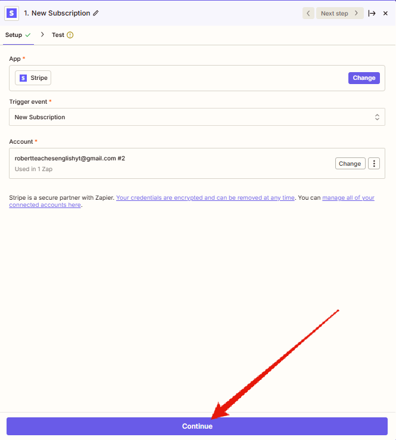

# Запуск процесу
Підключення проекту полягає в тому, щоб створити для кожного продукту Zap на підключення (при продажу клієент додається до групи в DrivEd, а також клієенту надсилається вітальне повідомлення), а також для кожного продукту Zap на відключення на випадок скасування підписки.

## Створення Zap
Бажано створювати Zap до відповідного клієнту у відповідній папці.
  
Починаємо зі створення тригеру (це подія, я якої починається виконання Zap)
  
Обираємо застосунок Stripe  для обрання тригерів.  
  
Через те, що це новий клієнт - важливо підключити новий API для 
  

Stripe буде пропонувати дати доступ до тестових даних. **Тестові дані** - інструмент, який дозволяє розібратися із принципами роботи API Stripe, проте він не дозволяє перевіряти реальну роботи flow, адже генеруєтья не за реальними подіями. Тому, якщо є хоча б базовий досвід і достатній рівень обережності, то підключення тестових даних не є необхідним.
   

В акаунті **Stripe** може бути декілька розділів, що відповідають клієентам. Обираємо той, який відповідає тому клієнту для якого налаштовуємо даний **automation**.

   

Після вибору облікового запису натискаємо кнопку "**Continue**"
   

Low-code системи (в т.ч. і Zapier) мають механізми перевірки взаємодії з зовнішніми сервісами. Для цього перед додаванням будь-якого елементу, що використовує таку взаємодію відбувається його тестування (для тригерів - отримуються дані від зовнішнього сервісу, для дій (actions) на зовнішній сервіс відправляють певні дані і отримується відповідь).  
В даному випадку - відбувається тест тригеру **New Subscription** від **Stripe**.
  
   

Для нових облікових записів може не бути зе підписок в обліковому записі:
  

Відповідно до цього - треба таку підписку створити, зробивши тестове придбання:  
Для цього створимо купон зі знижкою. Для підписок можлива 100% знижка

  

Для підписок можлива 100% знижка
  

Відповідно для застоусування знижки введемо промокод
  

Отримуємо повідомлення, що підписка підбулася
  

Відповідно до цього - бачимо підписку в переліку підписок в **Stripe**.
  

Маючи підписку ми можемо повернутися до **Zapier** і ще раз протестувати тригер
  

В результаті тесутвання **Zapier** отримує інформацію від **Stripe** щодо існуючих підписок. Через те, що така підписка одна ми отримаємо відповідну інформації у відповіді від **Stripe** (1). Для продовження натиснемо відповідну кнопку (2).

  

При продовженні **Zapier** нас попросить обрати сервіс для **Action**. Це - хороше рішення для UX, адже в будь-якому Zap має бути хоча б 1 action. Тому запропонувати його одразу - зручна можливість, хоча і може збити з пантелику тих, хто робить свій Zap вперше.

  

## Stripe
### Products
В даному прикладі продукти вже створені:
  

Для того, щоб клієнт міг зробити покупку необхідно мати платіжне посилання (**Payment Link**).  Його необхідно створити на відповідній сторінці в **Stripe**.  
   

Для створення посилання до нього потрібно додати відповідний продукт:  
  

Для того, щоб можна було користуватися промокодами навпроти відповідного пункту треба позначити чекбокс

  

## Створення Zap (підключення Drived)

  