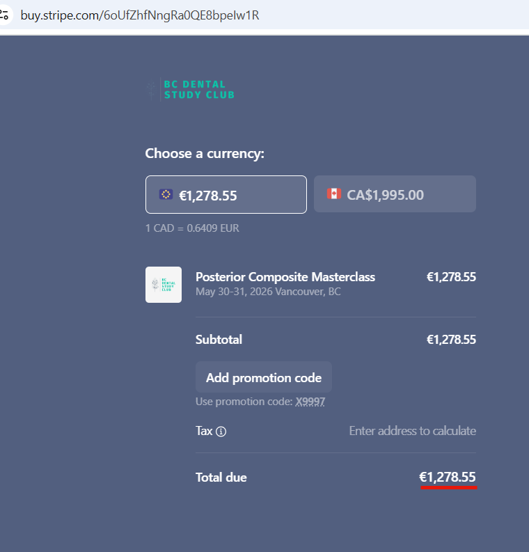
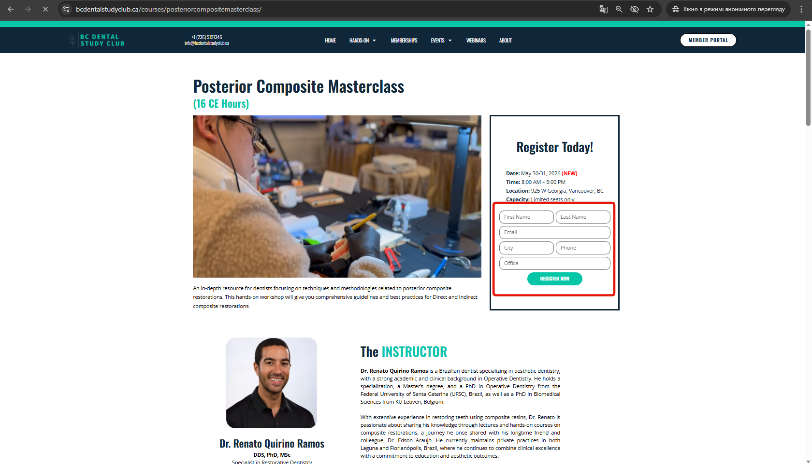
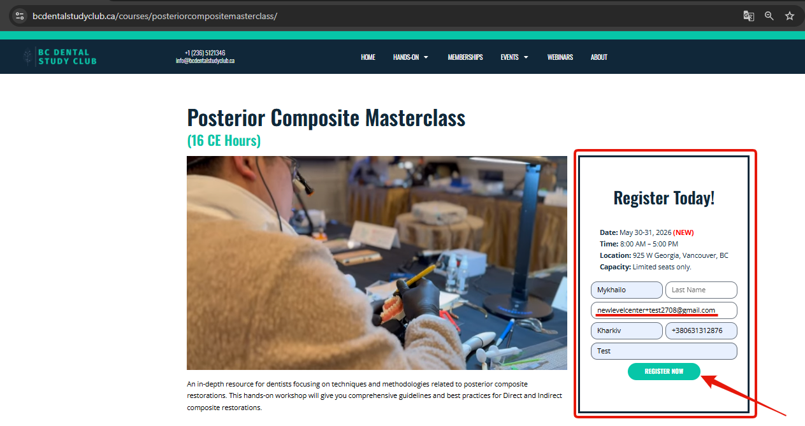
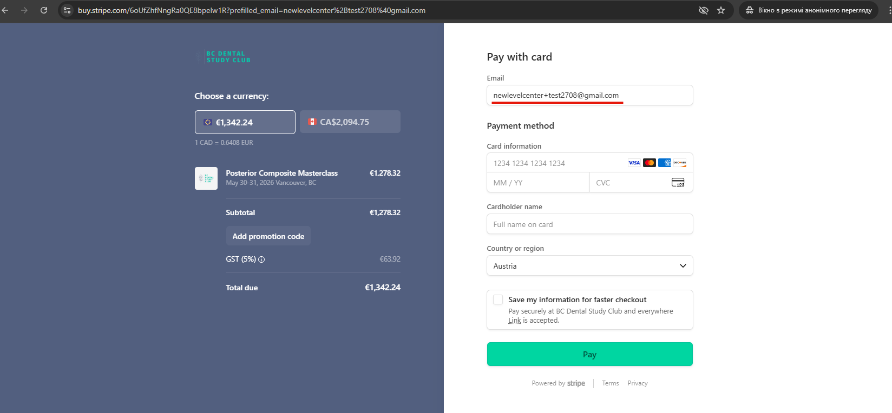
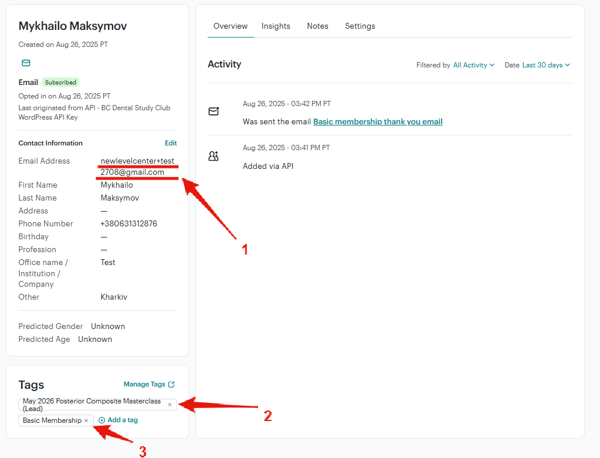
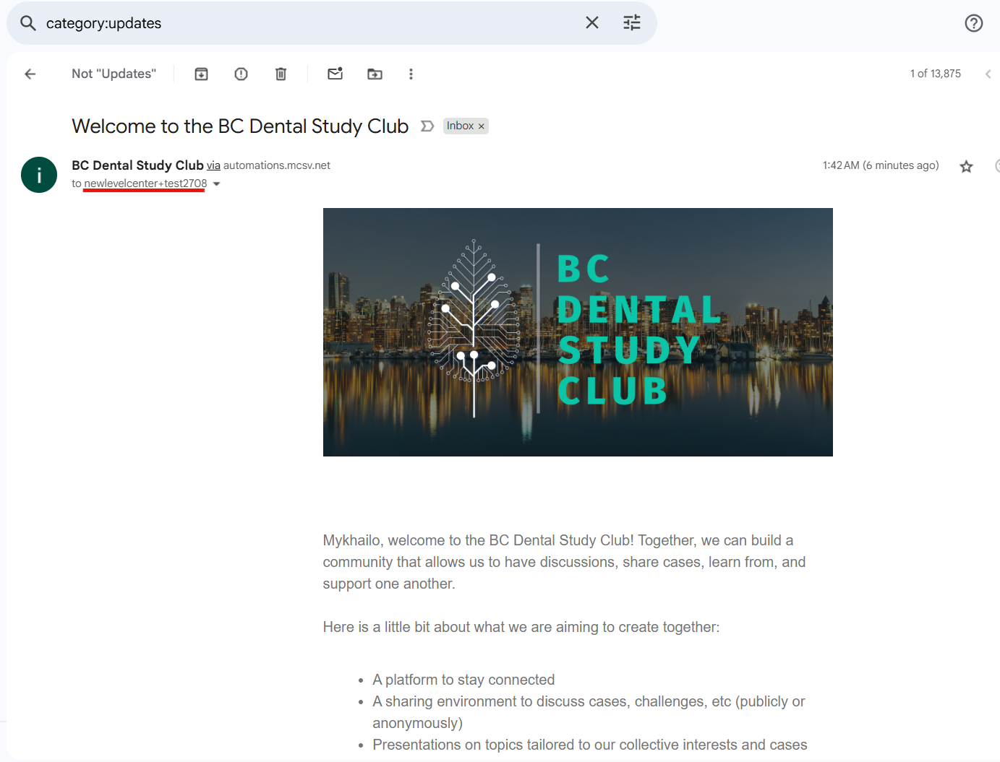

# Тестування виконаних робіт.
Для того, щоб перевірити, чи немає помилок в тому, як запрограмовані продукти основним методом є проведення тестової закупівлі.  
## Знижки
Через те, що продукти бувають дуже часто дорогими з одного боку, а, з іншого, Stripe не дає купляти повністю безкоштовні продукти необхідно максимально знизити вартість продукту, який купуємо. Проте ця сума, все ж таки, має відрізнятися від 0.  
Для Stripe є нижня ціна товару, яку можна зробити в результаті використання знижки (через використання купону). Експерементально знайдено, що ця сума дорівнює 0,35 Euro.
Для створення знижки, яка відповідає такій мінімальній ціні можна її підібрати вручну, або ж розрахувати. Для розрахунку потрібно різницю ціни поточного товару розділити та мінімально допустимої ціни товару необхідно поділити на ціну товару.  Тобто, якщо ціна товари p, то discount =((p-0,35)/p)*100%   

### Створення купона
Для того, щоб купити продукт зі знижкою необхідно створити відповідний купон зі знижкою. Для цього в Stripe необхцдно перейи до розділу **Product catalog** (1), в ньому перейти до розділу **Coupons** (2) та в цьому розділі натиснути кнопку **Create coupon** (3)  
   

### Розрахунок розміру знижки.
Для того щоб розмір знижки давав ціну зі знижкою, що є максимально близькою до мінімальної ціни треба провести обрахунки і обрату максимльно допустиму знижку (якщо ціна зі знижкою буде більшою, ніж мінімальна ціна, то форма **Stripe** видасть помилку):

   

Для розрахунку можна використати калькулятор. Нприклад для ціни p = 1278,55 Euro 

   

discount =(p-0,35)/p)*100% = ((1278,55-0,35)/1278,55) = 99,9726

   

Для визначення найбільшої з доступних знижок ми отримане число 0,999726 маємо округлити вниз до сотенних, тобто до 99,97. Через це, що **Stripe** дозволяє округлювати розмір знижки лише до другого знаку після коми.  

   

отже, нам потрібна знижка 99,97% , застосувавши яку до ціни **1278,55 Euro** отримаємо **0,38 Euro**, що дуже близько до мінімальної ціни продажу **0,35 Euro**

   

### Визначення розміру знижки для купону.
Для створеного купону ми задамо назву (**x9997**) - для зручності вона буде співпадати із текстом коду купона. Та задати розмір знижки.
   

А також додати код купону. Для цього увімкнути перемикач (1), ввести код (2). А також в кінці - натиснути кнопку створення купону (3).

   

## Процес тестування
### Сайт
В процесі тестування нам потрібно пройтись по всьому процесу, який відповідає діям, які може робити клієнт.  
Точкою входу є сторінка продукту нас сайті.  
   

Для тестування - ми беремо нашу поштову адресу і додаємо через + слово test та дату тестування. Наприклад newlevelcenter+test2708@gmail.com такий запис дозволяє використовувати одну і ту саму пошту для різних ситуацій (для сервісів будь-яка відмінність в адресі відповідає іншій пошті, в томй час, як Gmail відправляє поштки зі із будь-якими комбінаціями після + за адресою, що іде до симпола +)

   

### Результати дії 1.
За результатами першої дії (заповнення форми) є два результати: має бути заповнено поле із **email**.  

   

А також в **MailChimp** має бути створений користувачем із відповідним email. Із тегом **productName (Lead)**, тегом **Basic Membership**.  
   

А також на відповідну пошту має бути відправилений вітальний лист на базове членство (**Basic Membership**)

   